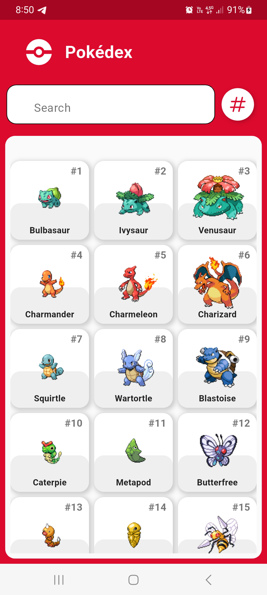
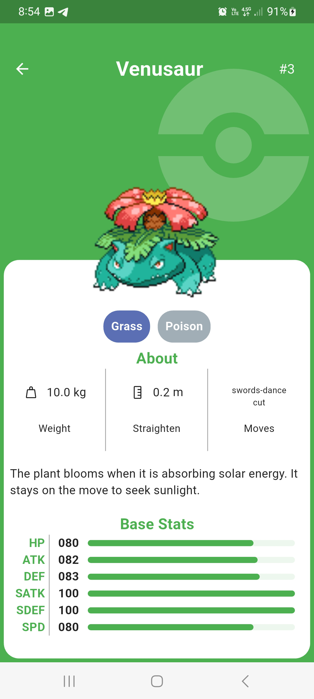
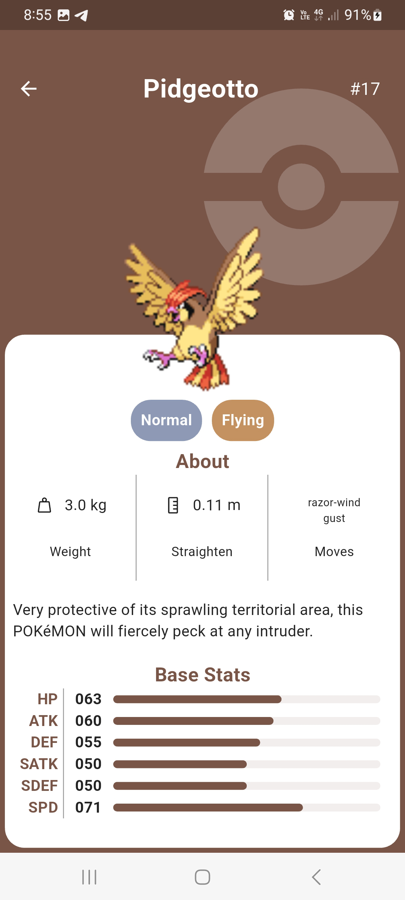
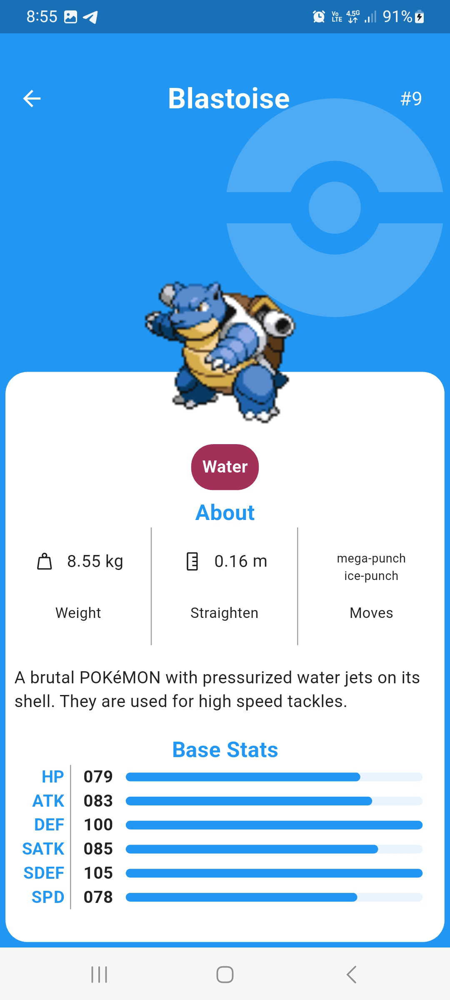
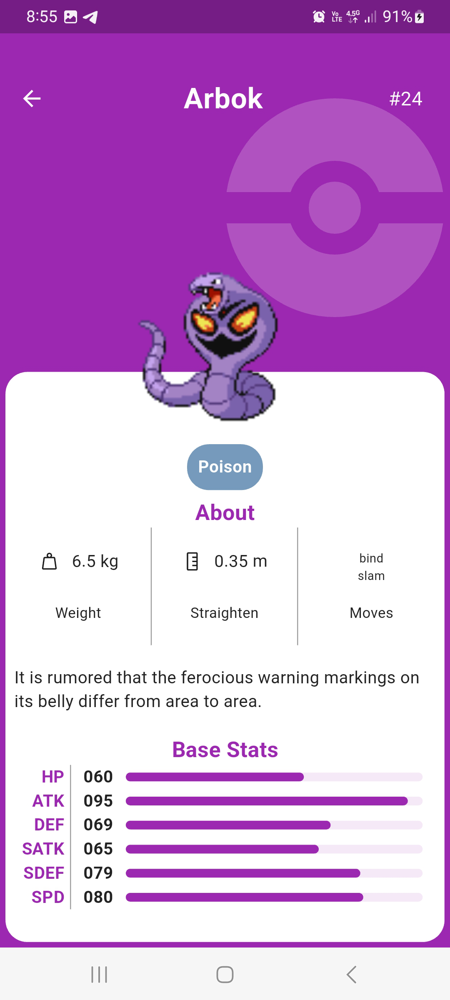

# Pokedex App

Pokédex App is an app developed in Flutter using GetX for state management, with features like search, paging, caching, and a dark mode.


## Screenshots















## Features

- List of Pokémon with pagination
- Search for Pokémon by number or name
- Sorting Pokémon by number or name
- Caching with Hive for offline mode
- SOLID design pattern
- Error handling and asynchronous responses
- Use Getx as a state manager in your application


## Tech Stack

**Flutter:** Cross-platform UI framework

**GetX:** Status and navigation management

**Dio:** Cliente HTTP para consumir la API

**Hive:** Local database for cache

**CachedNetworkImage:** Optimized image loading

**Dartz:** Functional programming in Dart

**Connectivity_plus:** This plugin allows Flutter apps to discover network connectivity types that can be used.


## Installation

App generated with the following packages

```bash
Flutter 3.27.0 • channel stable • https://github.com/flutter/flutter.git
Framework • revision 8495dee1fd (2 months ago) • 2024-12-10 14:23:39 -0800
Engine • revision 83bacfc525
Tools • Dart 3.6.0 • DevTools 2.40.2
```

```bash
OpenJDK Runtime Environment Temurin-17.0.7+7 (build 17.0.7+7)
OpenJDK 64-Bit Server VM Temurin-17.0.7+7 (build 17.0.7+7, mixed mode, sharing)
``` 

```bash
-------------------------------------------------------
    Gradle 8.8
-------------------------------------------------------

    Build time:   2024-05-31 21:46:56 UTC
    Revision:     4bd1b3d3fc3f31db5a26eecb416a165b8cc36082

    Kotlin:       1.9.22
    Groovy:       3.0.21
    Ant:          Apache Ant(TM) version 1.10.13 compiled on January 4 2023
    JVM:          17.0.7 (Oracle Corporation 17.0.7+8-LTS-224)
    OS:           Windows 10 10.0 amd64
``` 
## Project Structure


    |-- main.dart               # Application entry point
    |-- core/                   # Global application tools
    |   |-- error
    |   |-- source
    |   |-- utils
    |   |-- widgets
    |-- features/               # Clean architecture of pokemon functionality
        |-- pokemon
            |-- data
            |   |-- datasources
            |   |-- models
            |   |-- repositories
            |-- domain
            |   |-- entities
            |   |-- repositories
            |   |-- use_cases
            |-- presentation
            |   |-- bindings
            |   |-- controllers
            |   |-- pages
            |   |-- routes

## API Reference

```http
  This application consumes the PokéAPI, a REST service that provides detailed information about Pokémon.
```

#### Example of API call to obtain the Pokémon:

```http
  final response = await Dio().get("https://pokeapi.co/api/v2/pokemon?limit=20&offset=0");  
```

## Theme Customization

## Author

- Developed by Gerardo Aguilar Martínez

